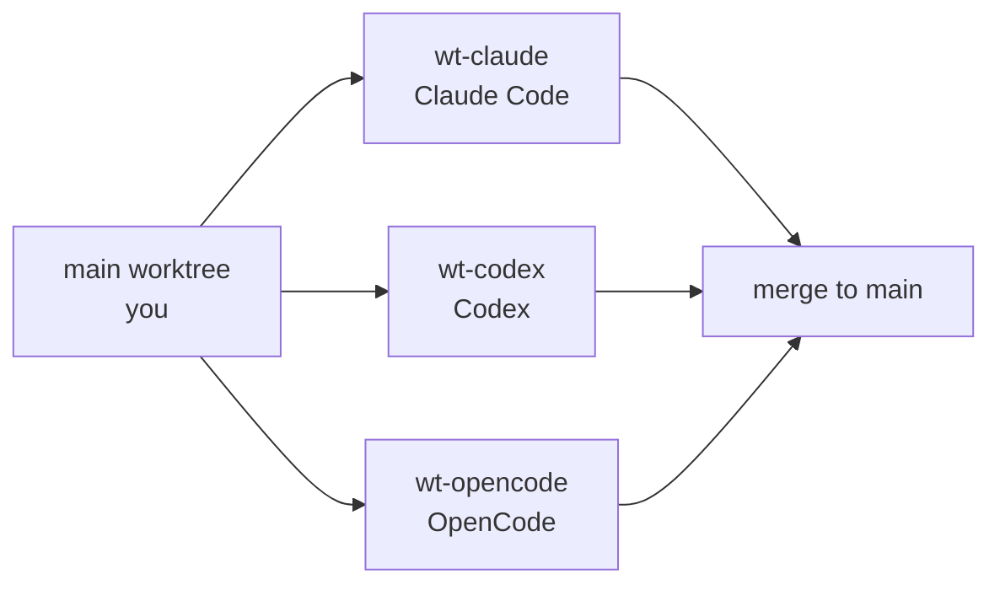

# Mac Dev Environment Setup Runbook

2026-09-19 · @Someone

A free, subscription-funded development environment on Apple Silicon: VS Code, Claude Code and Codex on existing subscriptions, Cline against a local model, and a personal GitHub identity firewalled from work. Every component is free. Beyond the two subscriptions already held, cost is zero.

**Built and verified 19 to 20 September 2026** on an M5 Max, 48 GB, macOS with Command Line Tools only. Every phase below was executed, not planned. Where reality diverged from the original plan, the phase carries a dated decision note explaining what changed and why.

Work top to bottom. Each phase ends with a verification command, and nothing downstream depends on a phase you have not verified. Phases 1 to 3 are the foundation, about twenty minutes. Phases 4 and 5 are the ones worth slowing down for: identity separation is the only thing here that fails silently and expensively.

**Two sections to read before starting rather than after.** *macOS traps that cost real time* covers four behaviors that produce symptoms resembling something else. *The framework audit* records twelve defects found in the agentic template during this build, all sharing one shape: a control that looked correct and enforced nothing.

> **Where this lives.** `github.com/SaltyBrett/dev-handbook` (private), at
> `runbooks/Mac_Dev_Environment_Setup_Runbook.md`. Two gates run on that repository —
> `gitleaks`, because a private repo on a free account gets no secret scanning from
> GitHub, and the commit-msg attribution gate. Install both hook types after cloning:
> `pre-commit install --hook-type pre-commit --hook-type commit-msg`.
>
> The framework template is a separate repository,
> `github.com/SaltyBrett/agentic-dev-template`, and projects are created from it rather
> than here — see *Starting a new project*.

## Contents

- [Phase 1 — macOS foundation](#phase-1--macos-foundation)
- [Phase 2 — Terminal and shell](#phase-2--terminal-and-shell)
- [Phase 3 — Language runtimes](#phase-3--language-runtimes)
- [Phase 4 — GitHub account, 2FA, keys, signing](#phase-4--github-account-2fa-keys-signing)
- [Phase 5 — Identity separation](#phase-5--identity-separation)
- [Phase 6 — VS Code](#phase-6--vs-code)
- [Phase 7 — Zed as secondary editor](#phase-7--zed-as-secondary-editor)
- [Phase 8 — Agent layer](#phase-8--agent-layer)
- [Phase 9 — Local models](#phase-9--local-models)
- [Phase 10 — Containers](#phase-10--containers)
- [Phase 11 — Land the framework template](#phase-11--land-the-framework-template)
- [Phase 12 — Multi-agent hygiene](#phase-12--multi-agent-hygiene)
- [Verification checklist](#verification-checklist)
- [macOS traps that cost real time](#macos-traps-that-cost-real-time)
- [Reading other people's signed commits](#reading-other-peoples-signed-commits)
- [Starting a new project](#starting-a-new-project)
- [The framework audit, 20 September 2026](#the-framework-audit-20-september-2026)
- [Sources](#sources)

---

## Phase 1 — macOS foundation

Everything else installs through Homebrew, so this phase gates the rest. Apple Silicon puts Homebrew at `/opt/homebrew`, not `/usr/local`. Any tutorial showing `/usr/local` was written for Intel and will leave you with a broken PATH.

**1. Xcode Command Line Tools.** You need the CLT, not full Xcode. CLT is roughly 2.7 GB and gives you clang, git, make, and the SDK. Full Xcode is 30+ GB and exists for building iOS and macOS apps, which you are not doing.

```bash
xcode-select --install
```

A dialog appears. Accept it and wait. If it reports the tools are already installed, move on.

**2. Homebrew.**

```bash
/bin/bash -c "$(curl -fsSL https://raw.githubusercontent.com/Homebrew/install/HEAD/install.sh)"
```

**3. PATH.** This step is mandatory, not optional. Homebrew will not work without it.

```bash
echo 'eval "$(/opt/homebrew/bin/brew shellenv)"' >> ~/.zprofile
eval "$(/opt/homebrew/bin/brew shellenv)"
```

Note `~/.zprofile`, not `~/.zshrc`. Login shells read `.zprofile`. Putting the line in both files gives you duplicate PATH entries, which is a common and confusing mistake.

**4. Core tools.**

```bash
brew install git gh jq fzf ripgrep bat gitleaks pre-commit
```

Install git from Homebrew even though macOS ships one. Apple's bundled git lags well behind, and commit signing wants a current version.

**Never run `sudo brew`.** It permanently breaks permissions in `/opt/homebrew` and the recovery is tedious.

**Verify:**

```bash
brew --prefix          # expect /opt/homebrew
git --version          # expect 2.4x or newer, not Apple's 2.39
which git              # expect /opt/homebrew/bin/git
```

If `which git` returns `/usr/bin/git`, your PATH did not take. Open a new terminal window and check again before continuing.

## Phase 2 — Terminal and shell

Ghostty is the 2026 pick: native AppKit rather than Electron, GPU-accelerated, MIT licensed, and it moved to non-profit fiscal sponsorship in December 2025, which is a good longevity signal. iTerm2 remains the mature alternative if you want its session management.

```bash
brew install --cask ghostty
brew install starship zsh-autosuggestions zsh-syntax-highlighting
```

**Avoid Warp.** It lifted its hard login requirement in November 2024, but telemetry is collected regardless of login state. A terminal that reports your command usage is a conversation you do not want to have later.

**Shell configuration.** zsh has been the macOS default since Catalina. Skip Oh My Zsh: it is shell script reinterpreted on every start, and benchmarks show startup dropping from roughly 0.38s to 0.07s when it is replaced with Starship plus a couple of plugins. Starship is a single Rust binary and gives you git branch, Python virtualenv, and Azure context in the prompt, which is worth more than a theme catalog.

Append to `~/.zshrc`:

```bash
cat >> ~/.zshrc <<'EOF'
# Starship prompt
eval "$(starship init zsh)"

# Completion + plugins
source /opt/homebrew/share/zsh-autosuggestions/zsh-autosuggestions.zsh
source /opt/homebrew/share/zsh-syntax-highlighting/zsh-syntax-highlighting.zsh

# fzf key bindings (Ctrl-R history search)
source <(fzf --zsh)

# Treat # as a comment when pasting multi-line blocks.
# Without this, a pasted comment line runs as a command and errors.
setopt interactive_comments

# Sensible history
HISTSIZE=50000
SAVEHIST=50000
setopt HIST_IGNORE_ALL_DUPS SHARE_HISTORY INC_APPEND_HISTORY

# Quality of life
alias ll='ls -lah'
alias cat='bat --paging=never'
EOF
```

**Also set the git pager**, or every `git diff`, `git log` and `git show` opens `less` and swallows anything you paste after it:

```bash
git config --global core.pager 'less -FRX'
```

`-F` exits when output fits one screen, `-R` keeps color, `-X` stops it clearing the screen.

**Window management.** macOS has no Alt-Tab-per-window equivalent. `Cmd+Tab` switches applications; `` Cmd+` `` switches windows within one application.

**Decision, 20 September 2026: native macOS tiling, no third-party tool.** Tiling matured in Sequoia and covers halves, quarters and drag-to-edge with nothing to install and no permissions to grant. Rectangle was installed, evaluated and removed. What it adds over native is thirds, two-thirds, a move-to-next-display shortcut, and easier shortcut ergonomics (`Ctrl+Option+Arrow` rather than `Fn+Ctrl+Arrow`). Revisit only if you find yourself wanting thirds on an external monitor.

If you do reinstall it, note that `brew install --cask rectangle` only puts it on disk. It does nothing until you `open -a Rectangle` and grant Accessibility in System Settings, and it will ask whether to disable macOS tiling or its own edge-drag handling. Leaving both active makes windows behave unpredictably.

**Verify:**

```bash
exec zsh
starship --version
echo $SHELL          # expect /bin/zsh
```

Open Ghostty from Applications. The prompt should render with git context when you `cd` into a repository.

## Phase 3 — Language runtimes

**uv for Python.** This is close to settled in 2026. uv replaces pip, pip-tools, pipx, poetry, pyenv, and virtualenv in one Rust binary, and it manages interpreters itself. The one place it genuinely loses is when you need non-PyPI native libraries such as CUDA, GDAL, or HDF5, where conda or pixi still wins. For dbt, SQL, and Azure work you will not hit that.

```bash
curl -LsSf https://astral.sh/uv/install.sh | sh
exec zsh
uv python install 3.12
uv tool install ruff
```

**Do not use Homebrew's Python as a project interpreter.** Homebrew upgrades it out from under you and breaks every virtualenv built against it. Homebrew Python exists to serve Homebrew's own formulae.

**mise for everything else.** mise manages Node, Terraform, kubectl, and about a thousand other tools from one `mise.toml`. It is Rust, so it avoids the shim and startup cost that made asdf and nvm slow, and it reads existing `.tool-versions` files if you inherit a project that uses asdf.

```bash
curl https://mise.run | sh
exec zsh
echo 'eval "$(mise activate zsh)"' >> ~/.zshrc
source ~/.zshrc
mise use -g node@lts
mise settings auto_update=true
```

**Not the Homebrew formula.** mise itself warns that its Homebrew build is substantially slower and larger than the optimized binary from `mise.run`, and mise activates on every shell start, so the cost lands where you notice it. The tradeoff is that Homebrew no longer updates it, which `auto_update=true` handles.

Let uv own Python and mise own the rest. mise can manage Python too, but uv is better at the project and lockfile layer, and the two integrate rather than compete.

**dbt, and a licensing change worth knowing.** dbt Labs now ships dbt v2 with the Rust Fusion engine as the default local install, and the command is `dbt`, not `dbt-core`. The default distribution bundles proprietary components and prompts `dbt login` for language-server features. The purely Apache-2.0 runtime is a separate package.

Per project, not globally:

```bash
uv init my-dbt-project && cd my-dbt-project
uv add dbt-oss dbt-fabric      # dbt-oss is the Apache-2.0 runtime
uv run dbt --version
```

**Azure CLI, mid-migration.** Microsoft is moving Azure CLI from a Homebrew Core formula to a Microsoft-owned cask to support broker-based authentication. The current path still works and is what you should use today.

```bash
brew install azure-cli
```

Watch for the GA announcement on the cask and migrate then. The formula path is slated for discontinuation after preview.

**Verify:**

```bash
uv --version
uv python list              # expect 3.12 present
mise --version
node --version
az --version
```

## Phase 4 — GitHub account, 2FA, keys, signing

> **Run this phase in two sittings.** Phase 4a is browser work with no dependencies, so do it before Phase 1. Phase 4b is terminal work that needs `gh` from Homebrew, so it waits until Phase 1 is done.
>
> **4a, do first:** create the account, set the email privacy options, enrol 2FA, copy your numeric user ID. **4b, after Phase 1:** `ssh-keygen`, `gh auth login`, `gh ssh-key add` twice, signing config.
>
> Revised order for the whole runbook: **4a, 1, 2, 3, 4b, 5, 6 onward.**

**What GitHub Free actually gives you in 2026,** verified against GitHub's own plans documentation:

| Item | Free | Pro adds |
| --- | --- | --- |
| Public repositories | Unlimited, full feature set | — |
| Private repositories | Unlimited, limited feature set | Protected branches, required reviewers, code owners, repo insights |
| Collaborators | Unlimited | — |
| Actions minutes per month | 2,000 | 3,000 |
| Packages storage | 500 MB | 2 GB |
| Codespaces per month | 120 core-hours, 15 GB | 180 core-hours, 20 GB |
| Support | Community | Email |

Pro is not justified for a solo developer. Branch protection on a repository where you are the only committer is theater, and 2,000 Actions minutes exceeds what a personal Python and dbt portfolio will consume. Revisit if you start burning minutes.

**Account creation.** Use a personal email address. Never a contractor, .mil, or .gov address. Your username is highly visible and effectively permanent, appearing in every commit URL and repository path, so pick something professional that names neither your employer nor any program. Yours is saltybrett, verified unclaimed on 19 September 2026.

**Immediately after signup,** go to Settings, then Emails, and enable both:

- Keep my email addresses private
- Block command line pushes that expose my email

GitHub then gives you a noreply address of the form `<numeric-id>+<username>@users.noreply.github.com`. On this account that is `331457608+SaltyBrett@users.noreply.github.com`, already filled into Phase 5. Copy it from the page rather than assembling it by hand; the numeric ID does not exist until the account does. Without this setting, your real email lands in every commit object you ever push.

**2FA.** Mandatory enrollment began in March 2023 for accounts that contribute code, with a 45-day window after notification. Assume you will be required and turn it on during setup rather than being locked out later.

GitHub's own guidance ranks TOTP above SMS and criticizes SMS directly as interceptable and not phishing-resistant. Recommended configuration:

1. **Passkey as primary.** On a Mac this is Touch ID via iCloud Keychain, and it satisfies password plus second factor in one step.
2. **TOTP app as fallback.** GitHub recommends a fallback even with a passkey, to avoid lockout.
3. **Download the recovery codes** and store them offline, not in the same password manager holding the account.
4. **Skip SMS entirely.**

**SSH key.** ed25519, not RSA. GitHub dropped older insecure key types in March 2022.

```bash
ssh-keygen -t ed25519 -C "personal" -f ~/.ssh/id_ed25519_personal
ssh-add --apple-use-keychain ~/.ssh/id_ed25519_personal
```

Give the key a passphrase. `--apple-use-keychain` stores it in macOS Keychain so you type it once. Older guides show `-K`, which was the flag on earlier macOS versions.

**Authenticate `gh` first, then upload the key from the terminal.** This replaces two separate trips to the web UI.

```bash
# Interactive menu, then a browser one-time code.
# Choose: GitHub.com > SSH > upload your .pub > Login with a web browser.
# Picking SSH uploads the authentication key for you.
gh auth login

# Signing keys sit behind a scope the default login does not request.
# This reopens the browser flow once. Skip it and the next command 404s.
gh auth refresh -h github.com -s admin:ssh_signing_key

gh ssh-key add ~/.ssh/id_ed25519_personal.pub \
  --title "MacBook Pro (signing)" --type signing

gh ssh-key list          # expect two entries: authentication + signing
```

**Commit signing.** SSH signing is the easy path now and GitHub's docs say so directly: SSH signatures are the simplest to generate, and you can reuse your authentication key. Requires git 2.34+, which Homebrew gave you in Phase 1.

```bash
git config --global gpg.format ssh
git config --global commit.gpgsign true
```

**Why the key goes up twice.** Authentication and signing are separate registrations of the same key. Register it only for authentication and your commits get no Verified badge, with no error to tell you why. Most guides omit `--type signing` because until recently it existed only in the web UI.

**Verify:**

```bash
ssh -T git@github.com     # expect: Hi saltybrett! You've successfully authenticated
gh auth login             # GitHub.com, SSH, select your key, browser flow
gh auth status
```

## Phase 5 — Identity separation

This is the phase that prevents a category of mistake that is embarrassing at best and a disclosure at worst: committing to a work repository under your personal identity, or the reverse. Four layers, and you want all four, because each catches what the others miss.

**Layer 1 — folder structure.** Everything else keys off directory paths, so establish them first.

```bash
mkdir -p ~/code/personal ~/code/work
```

**Layer 2 — SSH host aliases.** Write `~/.ssh/config`:

```bash
mkdir -p ~/.ssh && chmod 700 ~/.ssh
cat > ~/.ssh/config <<'EOF'
Host github.com-personal
  HostName github.com
  User git
  IdentityFile ~/.ssh/id_ed25519_personal
  IdentitiesOnly yes
  AddKeysToAgent yes
  UseKeychain yes

Host github.com-work
  HostName github.com
  User git
  IdentityFile ~/.ssh/id_ed25519_work
  IdentitiesOnly yes
  AddKeysToAgent yes
  UseKeychain yes
EOF
chmod 600 ~/.ssh/config
```

`IdentitiesOnly yes` is the load-bearing line. Without it, ssh offers every key in the agent and GitHub authenticates you as whichever matches first. That is precisely how people push to work repositories as their personal self. Clone with the alias: `git clone git@github.com-personal:you/repo.git`.

**Layer 3 — directory-scoped git identity.** Write `~/.gitconfig`:

```bash
# Base identity and behavior. Note: no global user.email, deliberately.
git config --global user.name "Brett Bennett"
git config --global init.defaultBranch main
git config --global core.autocrlf input
git config --global core.excludesfile ~/.gitignore_global
git config --global pull.rebase true

# Directory-scoped identity. The trailing slashes matter.
git config --global "includeIf.gitdir:~/code/personal/.path" ~/.gitconfig-personal
git config --global "includeIf.gitdir:~/code/work/.path" ~/.gitconfig-work
```

Use the `git config` commands rather than writing `~/.gitconfig` wholesale. Phase 4 already wrote `gpg.format` and `commit.gpgsign` into that file, and a heredoc would silently erase them.

The trailing slash on each `gitdir:` path matters and is a common silent failure. Then `~/.gitconfig-personal`:

```bash
cat > ~/.gitconfig-personal <<'EOF'
[user]
    email = 331457608+SaltyBrett@users.noreply.github.com
    signingkey = ~/.ssh/id_ed25519_personal.pub
[url "git@github.com-personal:"]
    insteadOf = git@github.com:
EOF
```

That `insteadOf` rewrite means even a plain `git@github.com:` URL routes through the personal alias inside `~/code/personal`.

**Layer 4 — make the failure loud.** Note that `~/.gitconfig` above deliberately sets no global `user.email`. Add this:

```bash
git config --global user.useConfigOnly true
```

Git now refuses to commit in any directory not covered by an `includeIf` block, rather than guessing an address from your hostname and username. This converts a silent wrong-identity commit into an error you cannot miss. It is the single highest-value line in this phase.

**Global gitignore.** macOS scatters `.DS_Store` files everywhere.

```bash
cat > ~/.gitignore_global <<'EOF'
.DS_Store
.AppleDouble
.LSOverride
._*
.Spotlight-V100
.Trashes
Icon?
EOF
```

**The gh CLI footgun.** `gh` supports multiple accounts through `gh auth switch`, but only one is active at a time, and it does not follow your directory. Check `gh auth status` before any `gh repo create`.

**Verify:**

```bash
cd ~/code/personal && git init /tmp/idtest 2>/dev/null; cd /tmp/idtest
git config user.email          # should be empty or error, /tmp is uncovered
cd ~/code/personal
mkdir -p t && cd t && git init -q && git config user.email
# expect your users.noreply.github.com address
```

If the second command returns nothing inside `~/code/personal`, your `includeIf` path is wrong. Check the trailing slash.

## Phase 6 — VS Code

```bash
brew install --cask visual-studio-code
```

Sign in to Settings Sync if you want your Windows keybindings and layout to carry across. Most of your muscle memory survives intact.

**Telemetry off.** Open Settings JSON with `Cmd+Shift+P`, then "Preferences: Open User Settings (JSON)":

```json
{
  "telemetry.telemetryLevel": "off",
  "files.insertFinalNewline": true,
  "files.trimTrailingWhitespace": true,
  "editor.formatOnSave": true,
  "git.autofetch": true,
  "terminal.integrated.defaultProfile.osx": "zsh"
}
```

Or write it directly, which is faster and avoids the GUI:

```bash
mkdir -p ~/Library/Application\ Support/Code/User
cat > ~/Library/Application\ Support/Code/User/settings.json <<'EOF'
{
  "telemetry.telemetryLevel": "off",
  "files.insertFinalNewline": true,
  "files.trimTrailingWhitespace": true,
  "editor.formatOnSave": true,
  "git.autofetch": true,
  "terminal.integrated.defaultProfile.osx": "zsh"
}
EOF
```

Do this **before** signing into Settings Sync. Afterwards it would overwrite whatever Sync pulled down from your Windows machine.

Note the limit: `telemetry.telemetryLevel` governs Microsoft's own telemetry and does not cover extensions. Each extension's data handling is its own question.

**BYOK, the part most comparison articles get wrong.** I verified this against Microsoft's documentation directly: BYOK models work without signing into a GitHub account and without a Copilot plan. Built-in providers are Anthropic, OpenAI, Google Gemini, Azure, and a Custom Endpoint for anything OpenAI-compatible.

To configure: open the Chat view, click the model picker, choose **Manage Models**, pick a provider, and paste your API key. Keys are stored in the OS keychain.

**What BYOK does not cover.** Semantic search, inline code completions, and anything embedding-based still require a GitHub account and a Copilot plan. BYOK applies to the chat experience and utility tasks. If you want inline completions specifically, that is the one thing worth the Copilot Free tier, which gives 2,000 completions per month with automatic model selection.

> **Decision, 19 September 2026: BYOK not used.** This machine authenticates through Claude and ChatGPT subscriptions instead of API keys, so no keys are entered here. The subsection above stays as reference for if that changes. Consequence: no inline completions and no semantic search, since both require a Copilot plan.

**Extensions for your stack.** Note that Azure Data Studio was retired on 28 February 2026 with no further updates or security fixes; VS Code with the MSSQL extension is Microsoft's designated replacement, and existing queries, scripts, and database projects carry over without conversion.

```bash
code --install-extension ms-python.python
code --install-extension ms-python.vscode-pylance
code --install-extension charliermarsh.ruff
code --install-extension ms-toolsai.jupyter
code --install-extension ms-mssql.mssql
code --install-extension innoverio.vscode-dbt-power-user
code --install-extension ms-azuretools.vscode-azurefunctions
code --install-extension ms-azuretools.vscode-docker
code --install-extension GitHub.vscode-pull-request-github
code --install-extension eamodio.gitlens
code --install-extension redhat.vscode-yaml
```

The official dbt extension was relicensed in September 2026 under the dbt Product Licensing Agreement. The previous 15-user cap no longer applies, it is free for commercial use, and it works in airgapped environments. The Microsoft Fabric extension is GA and now open source, which materially improves its odds of working in forks.

**Why not VSCodium.** Microsoft began technically enforcing its extension license in April 2025 with binary environment checks, blocking Pylance, C/C++, and Remote-SSH in every fork. Losing Pylance is a real Python downgrade. Since Microsoft telemetry is fully disableable and BYOK keeps your code out of Microsoft's path anyway, the trade does not pay. If you want VSCodium regardless, substitute basedpyright and Ruff for Pylance.

**Verify:**

```bash
code --version
code --list-extensions | wc -l
```

Open the Chat view and confirm your BYOK provider responds without a GitHub sign-in prompt.

## Phase 7 — Zed as secondary editor

> **Not installed.** Zed's value in this stack was its free BYOK, which needs API keys. Without them it is a second editor with no advantage over VS Code for dbt or notebooks. Revisit only if the no-keys constraint changes.

```bash
brew install --cask zed
```

Zed is worth having alongside VS Code, not instead of it. Independent power benchmarking on an M2 using Apple's own `powermetrics` measured Zed at 471 mW against VS Code at 1,217 mW and a JetBrains IDE at 2,908 mW over 30-minute sessions with the same language server. That is real battery life on a laptop, and the architecture explains it: Zed is native Rust with GPU-accelerated rendering, VS Code is Electron, JetBrains is JVM.

Treat those multipliers as directional rather than exact. It is a single author on a single machine with a Go workload, and VS Code was configured with minimal extensions. Your Python plus Jupyter plus dbt profile would be worse than 1,217 mW.

**Zed has the best free BYOK implementation in the field.** Its documented providers are Anthropic, OpenAI, Google, Mistral, DeepSeek, xAI, OpenCode, OpenRouter, Vercel AI Gateway, Ollama, and LM Studio, plus any Anthropic-compatible or OpenAI-compatible endpoint with a custom base URL. Bedrock and Vertex arrive through the gateway path, Azure OpenAI through the OpenAI-compatible path. Keys live in the macOS keychain, not in `settings.json`, and BYOK is explicitly unlimited on the free Personal tier.

Its privacy posture is the strongest here: Zed does not retain prompts or code context by default, and with BYOK it is not in the request path at all. Training-data contribution is opt-in.

**Why it is not your primary.** Two gaps hit your stack precisely:

- **Jupyter is still experimental.** It needs `LOCAL_NOTEBOOK_DEV=1` and feature flags, and the known breakage includes pandas DataFrames not displaying properly, no cell deletion UI, and no way to terminate a running cell. Maintainers have given no timeline.
- **dbt has no language server and no Jinja-SQL highlighting.** The tracking issue is open and unassigned. A minimal third-party extension exists but is not comparable to dbt Power User.

Use Zed for fast editing, reading code, and anything where you are on battery. Keep notebooks and dbt in VS Code.

**Verify:** open Zed, press `Cmd+,`, add one API key under Assistant settings, and confirm a chat response.

## Phase 8 — Agent layer

> **As built, 20 September 2026.** Claude Code and Codex on existing subscriptions, plus Cline pointed at a local model. OpenCode and Zed are not installed.
>
> **The constraint and the original goal conflict.** Subscriptions are per-vendor by construction, and Anthropic banned third-party harnesses from using Claude subscription tokens in January 2026. There is no subscription path to provider breadth. Two vendors at flat cost was chosen over many vendors at metered cost.
>
> **One correction to an earlier reading.** Cline and Zed were first assessed as needing API keys. That is true for cloud models and false for local ones: Ollama is a local server, not a key-based service. Cline against Ollama therefore satisfies the no-keys constraint and is installed in Phase 9.
>
> **Two third-party options researched and parked:**
>
> - **Grok via Kilo Code.** SuperGrok or X Premium+ authenticates by xAI OAuth, no API key, in a VS Code extension. Kilo reads `AGENTS.md` natively and cannot disable it. One gap: `kilo.jsonc`'s project `instructions` array outranks `AGENTS.md`, so it must stay empty, ideally enforced by a scan.
> - **Gemini via Antigravity.** Gemini Code Assist stopped serving consumer accounts on 18 June 2026, including Google AI Pro and Ultra, so there is no VS Code path. Antigravity is a separate editor and reads `.agents/rules/`, not `AGENTS.md`. Bridging it needs a generated mirror plus a divergence gate, not a pointer file, because an instruction to read the brain is exactly the link that drifts.

Stage this in three waves rather than installing all four at once. Each wave gets verified against your framework repository before the next one lands.

### Wave 1 — what you already run

```bash
brew install --cask claude-code
npm install -g @openai/codex
```

If `claude-code` is not available as a cask, use the official installer from Anthropic's documentation.

**Two settings to check on Claude Code:**

1. **Version.** `claude --version` must be 2.1.277 or newer for native `AGENTS.md` reading. Your framework does not depend on it, because your `CLAUDE.md` already imports `@AGENTS.md`, but knowing which path is active matters when you debug.
2. **Data retention.** On consumer plans, if the training toggle is on, transcripts are retained for five years. Off means 30 days. Check it at `claude.ai/settings/data-privacy-controls`. This is the largest privacy exposure in the whole landscape and the default is the wrong way round for client work.

**The trap that will bite your governance setup.** Sessions that do not fetch feature flags cannot read `AGENTS.md` natively, and the Project instructions option disappears from `/config`. That includes sessions on Bedrock or another third-party provider, and any session with `DISABLE_TELEMETRY` set. Telemetry hardening and native `AGENTS.md` are mutually exclusive right now. Your `@AGENTS.md` import pattern is immune to this, which is why it stays.

### Wave 2 — OpenCode, the breadth layer

```bash
brew install sst/tap/opencode
```

OpenCode reaches 75+ providers through the Vercel AI SDK and the Models.dev catalog, including OpenAI, Anthropic, Vertex, Bedrock, Azure, Groq, DeepSeek, xAI, Together, Fireworks, and OpenRouter. Local models are first-class: Ollama, LM Studio, and llama.cpp are all documented. It reads `AGENTS.md` as its primary file, supports subagents with per-agent models and allow/ask/deny permissions, `/undo`, MCP, and LSP.

```bash
opencode auth login      # per provider; adds credentials
```

**Budget reality.** Anthropic banned third-party harnesses from using Claude subscription tokens; enforcement began January 2026 and the terms were clarified on 20 February 2026. OpenCode removed Claude Pro and Max login in response. Your Claude Max subscription cannot fund OpenCode. Anthropic models there cost API rates. Community plugins re-add subscription auth and describe themselves as grey-area workarounds that may break; treat them accordingly.

**One setting to add now,** because OpenCode deliberately reads Claude Code's files:

```bash
echo 'export OPENCODE_DISABLE_CLAUDE_CODE_SKILLS=1' >> ~/.zshrc
```

This leaves `AGENTS.md` reading intact while stopping skill pickup from `.claude/`. Your `AGENT_INTEROP.md` already declares tool skills as accelerators rather than sources of truth, so this makes the policy mechanical. Use `OPENCODE_DISABLE_CLAUDE_CODE=1` if you want the broader opt-out.

**The argument for OpenCode beyond provider count.** It pins model-provider pairs. There was a documented April 2026 Claude Code regression where system prompts changed unannounced and degraded output, with no version pinning available to users. Having one harness where the model cannot shift under you is a structural control over exactly the class of drift you have been fighting.

### Wave 3 — Cline, installed against local models only

Cline is installed, but as the consumer for Ollama rather than for cloud models. Its install and configuration live in **Phase 9**, since it is useless here without a local server to talk to.

One caveat that only applies to Cline's paid tier: a June 2026 discussion asking Cline to document whether the ClinePass upstream providers retain or train on code remains unanswered by maintainers. That affects ClinePass, not BYOK and not local models, but it would be disqualifying for proprietary code.

### The VS Code extensions

The CLI and the extension are separate installs that share a name and share authentication. You want both: the extension gives you the panel, inline diffs and plan review, while the CLI is what runs when you type `claude` or `codex` in any terminal.

```bash
code --install-extension anthropic.claude-code
code --install-extension openai.chatgpt
```

| Extension | Publisher | ID |
| --- | --- | --- |
| Claude Code | Anthropic | `anthropic.claude-code` |
| Codex, OpenAI's coding agent | OpenAI | `openai.chatgpt` |

Sign in from inside each panel, choosing the subscription rather than an API key. Both pick up the CLI authentication.

**Clear Restricted Mode first.** VS Code Workspace Trust limits what extensions may do, and both agents need to run tasks and edit files. Click **Restricted Mode** in the status bar and trust the folder, or they behave oddly for reasons that look like bugs.

**`Cmd+Esc`** toggles focus between the editor and Claude's prompt box. On Windows that is `Ctrl+Esc`, which is the Start menu, so that muscle memory does not transfer.

**The CHAT tab is Copilot**, not either agent. It ships with VS Code and needs a plan or a key, so it stays inert. Hide it with `"chat.commandCenter.enabled": false` if reaching for the wrong tab becomes a habit.

**As-built versions:** Claude Code 2.1.267, Codex CLI 0.155.1. Note that 2.1.267 is below the 2.1.277 that added native `AGENTS.md` reading, which costs nothing because the `@AGENTS.md` import in `CLAUDE.md` works on any version. Had the framework relied on native reading, governance would not have loaded at all and nothing would have said so.

### What is not worth installing

| Tool | Status |
| --- | --- |
| Continue.dev | Acquired by Cursor, repository read-only since 19 June 2026 |
| Roo Code | Shut down 15 May 2026 |
| Amazon Q Developer | New signups blocked May 2026, end of support April 2027 |
| Aider | No release since August 2025, docs still recommend 2025-era models |
| Qwen Code free tier | OAuth tier closed 15 April 2026 |
| Windsurf | Rebranded Devin Desktop; the old domain redirects |

**Verify:**

```bash
claude --version
codex --version
code --list-extensions | grep -E 'anthropic.claude-code|openai.chatgpt'
```

## Phase 9 — Local models

This is the only configuration where your code never leaves the machine. Worth having even if you rarely reach for it, because it is the fallback if a program ever prohibits commercial LLM egress.

```bash
brew install ollama
brew install --cask lm-studio
brew services start ollama
```

**Models sized for Apple Silicon.** Pick by unified memory: on 16 GB stay at 7B to 14B quantized; on 32 GB or more a 32B model is comfortable.

**As built on an M5 Max, 48 GB.** Qwen3-Coder is the consistent top pick for local coding, and its tool-calling is the part that matters for agent use.

| Tag | Size | Verdict |
| --- | --- | --- |
| `qwen3-coder:latest` (q4\_K\_M) | 19 GB | **Chosen.** Leaves \~29 GB for macOS, VS Code and a browser |
| `qwen3-coder:30b-a3b-q8_0` | 32 GB | Better quality, but 32 GB plus \~14 GB of system leaves no headroom. It swaps |
| `qwen3-coder:480b` | 290 GB | Not on this machine |

```bash
ollama pull qwen3-coder
ollama pull nomic-embed-text
ollama run qwen3-coder "write a python function that reverses a string"
```

`/bye` exits. The second model is \~270 MB and gives you embeddings for local retrieval later.

### Context length: the number Ollama serves is not the model's ceiling

`ollama show qwen3-coder` reports a context length of 262144. That is the model's maximum, not what the server allocates. The runtime default is far lower, and a client configured above it gets **silently truncated** with no error, which shows up as an agent that forgets the start of a file.

**The environment variable does not survive.** `OLLAMA_CONTEXT_LENGTH` added to `~/Library/LaunchAgents/sh.brew.ollama.plist` is discarded, because Homebrew regenerates that plist on every `brew services` command and every upgrade. Verified: the key was added to the file and absent from the running process after restart.

**Bake it into the model instead.** Survives restarts, upgrades and plist regeneration:

```bash
cat > /tmp/qwen3-coder-32k.Modelfile <<'EOF'
FROM qwen3-coder
PARAMETER num_ctx 32768
EOF
ollama create qwen3-coder-32k -f /tmp/qwen3-coder-32k.Modelfile
ollama show qwen3-coder-32k | grep -A8 Parameters
```

Reuses the same weights, so no second download and negligible extra disk. Look for `num_ctx 32768`.

**Already tuned by Homebrew:** `OLLAMA_FLASH_ATTENTION=1` and `OLLAMA_KV_CACHE_TYPE=q8_0` are set by the formula's service block. Together they roughly halve what 32k of context costs in memory. Confirm with:

```bash
ps eww -p $(pgrep -f "ollama serve") | tr ' ' '\n' | grep OLLAMA
```

### Nothing in this stack consumes it by default

Worth stating plainly, because installing Ollama does not by itself give you a local coding agent.

- **Claude Code** runs Anthropic models only. It cannot point at Ollama, by design.
- **Codex** nominally supports custom providers, but independent testing found it went Responses-API-only in February 2026, so third-party endpoints typically connect and then never fire tools.

**Cline is the consumer.** It is free, Apache-2.0, and pointing it at a local server involves no API key, which is what makes it compatible with the no-keys constraint. A cloud model in Cline would need a key; a local one does not.

```bash
code --install-extension saoudrizwan.claude-dev
```

The marketplace ID says `claude-dev` because the project launched as "Claude Dev" before being renamed. It is Cline, published by `saoudrizwan`, and has no relationship to Anthropic.

**Onboarding: choose "Bring my own API key", not "Absolutely Free."** The free option routes your code through Cline's hosted infrastructure to an upstream model, which is the opposite of local and defeats the reason for running Ollama at all. The BYO-key path is where the local providers live, despite the name.

**Settings as configured:**

| Field | Value |
| --- | --- |
| API Provider | Ollama |
| Base URL | `http://localhost:11434` |
| Ollama API Key | empty |
| Model | `qwen3-coder-32k:latest` |
| Model Context Window | 32768 |
| Request Timeout | 120000 |
| Use compact prompt | off |
| Different models for Plan and Act | off |

**Raise the timeout.** The 30000 ms default is 30 seconds, and a 30B model running locally on long agentic output will hit that ceiling constantly.

**Leave compact prompt off.** It exists for models capped near 8k context and it disables MCP and Focus Chain. The real tradeoff is that Cline's full system prompt is large, so a 32k window leaves nearer 20k for your code. If that binds, build a 64k variant the same way rather than shrinking the prompt.

**Cline's own warning is honest:** it uses complex prompts and works best with Claude models. Expect Qwen3-Coder here to be useful and not equivalent. Measured on a real governance task, it failed to follow a `@AGENTS.md` import, skipped the cold start, wrote unparseable YAML, and reported a commit it had not made.

**LM Studio versus Ollama.** They are not redundant. Ollama is the CLI-first daemon that agents discover automatically. LM Studio gives you a GUI for trying models, comparing quantizations, and watching memory pressure before you commit a 40 GB download. Keep both; use LM Studio to evaluate, Ollama to serve.

**Verify:**

```bash
ollama list
ollama run qwen3-coder:30b "write a python function that reverses a string"
curl -s http://localhost:11434/api/tags | jq '.models[].name'
```

## Phase 10 — Containers

> **Not done, 20 September 2026.** No container runtime is installed. Nothing in the current Python or dbt work needs one locally. This phase is kept as reference for when something does. The Docker Desktop licensing threshold below is the part worth reading before installing anything Docker-branded on a machine that touches work.

```bash
brew install --cask orbstack
```

OrbStack is free for personal, non-commercial use and measurably the fastest option on Apple Silicon: roughly 10 GB/s volume reads and 130 Gbps container-to-container throughput in published benchmarks. It is proprietary, and commercial use is $8 per user per month.

**Docker Desktop licensing.** Free only for companies under 250 employees *and* under $10 million annual revenue. Any real defense contractor is over that line. This machine is personal so it does not apply here, but if you ever put work on it, confirm a seat exists before installing anything Docker-branded.

**Free and open-source alternatives,** if you would rather have one license story that works everywhere:

| Option | License | Notes |
| --- | --- | --- |
| Colima | OSS | Lima-based, CLI only. Fastest startup measured at 0.291s, best HTTP latency at 1.56ms TTFB |
| Podman Desktop | OSS | Daemonless and rootless. Strongest in security-conscious shops, needs tuning to match OrbStack |
| Rancher Desktop | OSS | Bundles k3s. Pick this if you want local Kubernetes |

Colima with Rosetta:

```bash
brew install colima docker
colima start --vm-type vz --vz-rosetta --cpu 4 --memory 8
```

**The Apple Silicon trap.** Your Mac is arm64. Images built for `linux/amd64` need emulation. OrbStack and Docker Desktop use Rosetta 2 for near-native x86 emulation; plain QEMU is markedly slower. If anything you build targets x86 on Azure, build multi-arch from the start:

```bash
docker buildx build --platform linux/amd64,linux/arm64 -t myimage .
```

Skipping this produces images that run perfectly on your laptop and fail in the cloud, which is a bad way to find out.

**Verify:**

```bash
docker run --rm hello-world
docker info | grep -i architecture
```

## Phase 11 — Land the framework template

The de-branded template arrived as `agentic-dev-template.zip`. It has a fresh git history with one commit, no employer remote, and all three gates passing. Your employer's copy on its GitHub Enterprise instance is untouched.

> **This phase is the build log for 19 September, not the procedure for a second machine.** The template now lives on GitHub, so a new machine clones it rather than unpacking an archive:
>
> ```bash
> cd ~/code/personal
> git clone git@github.com-personal:SaltyBrett/agentic-dev-template.git
> ```
>
> That also sidesteps the `~/Downloads` consent dialog described in *macOS traps*, and it avoids defect 3 below, since a clone gets a fresh `.git/config` rather than whatever the archive carried. Steps 1 and 3 still apply to a clone; steps 2, 5 and 6 do not.

**What changed from the original,** recorded as decision `2026-09-19-001` in `sprint/decision-log.md`:

| Area | Change |
| --- | --- |
| `resources/branding/` | Shipped empty with a scaffold; brand assets removed |
| `resources/README.md` | Tokenized; structure kept, brand values replaced |
| Document production standard | Sections 1 to 6 tokenized; sections 7 to 14 craft rules intact |
| `scripts/md_to_docx.py` | Calibri, Calibri Light, Consolas replaced with Titillium Web, Catamaran, Menlo |
| `.gitignore` | Added `.venv/`, macOS artifacts, secrets patterns, dbt targets |
| Git history | Fresh `init`; employer remote and stale generated hook dropped |
| Knowledge base | Added `reference_macos_toolchain.md`, registered in `INDEX.md` |

**1. Install the fonts.** The generator now emits fonts that must exist to render correctly.

```bash
brew install --cask font-titillium-web font-catamaran
```

**2. Unpack into the personal tree.**

```bash
cd ~/code/personal
unzip ~/Downloads/agentic-dev-template.zip
cd agentic-dev-template
```

**3. Install the gates. This step is mandatory, not optional.**

```bash
pre-commit install --hook-type pre-commit --hook-type commit-msg
pre-commit run --all-files
ls -1 .git/hooks/ | grep -E '^(pre-commit|commit-msg)$'
```

`.git/hooks/` is never committed, so a fresh clone has no hook until you run this. The original repository's generated hook had a hardcoded Windows interpreter path, which on macOS silently falls through to a PATH lookup rather than failing loudly. Your compliance gate should not depend on a fallback branch. Verify before your first commit, not after.

**The first `pre-commit run` needs the network.** Two hooks now declare `additional_dependencies` — `tomli` for the identity guard on Python below 3.11, `pyyaml` for the frontmatter gate — so the first run in a fresh clone builds those environments from a package index:

```
[INFO] Initializing environment for local:tomli.
```

It is cached afterwards and every later run is offline. On an airgapped machine, run it once while connected or the gates cannot start.

**4. Confirm the gates pass.**

```bash
pre-commit run --all-files
```

Thirteen hooks run and all pass; the fourteenth is the `commit-msg` attribution gate, which this command does not exercise. To test that one, see *Starting a new project*.

**Run them through `pre-commit`, not directly.** The scripts were stdlib-only when this template landed and no longer are. `kb_frontmatter_scan.py` needs `pyyaml` and exits 2 on a stock interpreter; the identity guard needs `tomllib`, which is stdlib only from Python 3.11, and falls back to `tomli`. `pre-commit` provisions both; your ambient `python3` does not:

```bash
python3 scripts/kb_frontmatter_scan.py   # exit 2 — no pyyaml
pre-commit run kb-frontmatter-scan --all-files   # passes
```

Direct invocation still works for the two pure-stdlib scanners and is the only way to pass their ad-hoc flags — `banned_feature_scan.py --path`, `kb_freshness_scan.py --list`. Use `python3`, never a bare `python`; macOS has no such name.

**5. Create the private repository and push.**

```bash
gh auth status                      # confirm the personal account is active
gh repo create agentic-dev-template --private --source=. --remote=origin
git push -u origin main
```

**6. Verify the commit signed and the identity is right.**

```bash
git log --show-signature -1
git log -1 --format='%an <%ae>'      # expect your users.noreply address
```

If the signature shows as unverified, you added the key to GitHub as an authentication key only. Add it a second time as a signing key.

**Secret scanning gap, worth repeating.** Secret scanning and push protection run free on *public* repositories only. Private repositories on a free personal account get nothing; that requires GitHub Secret Protection, a Team or Enterprise add-on. This is the inverse of most people's intuition. Your local `pre-commit` plus `gitleaks` is the only control you have on this repository, which is why step 3 is not optional.

Add gitleaks to the gate chain in `.pre-commit-config.yaml` when you are ready:

```yaml
  - repo: https://github.com/gitleaks/gitleaks
    rev: v8.21.2
    hooks:
      - id: gitleaks
        stages: [pre-commit]    # REQUIRED — see below
```

**The `stages:` line is not optional.** Gitleaks' upstream `.pre-commit-hooks.yaml` declares no `stages:` key, and a hook without one runs at *every installed stage*. Now that both hook types are installed, the snippet without that line runs gitleaks twice on every commit — once at `pre-commit` and again at `commit-msg`. Decision `2026-09-20-001` requires an explicit `stages:` on every hook for exactly this reason; it applies to hooks you pull from other repositories, not only your own.

**What stays out of this repository.** Anything CUI or ITAR/EAR controlled. Source code written on the clock. Customer, program, or contract identifiers. Schemas, table names, column names, and dbt model names from work systems, which leak more than people expect. Azure tenant and subscription IDs, resource group names, internal hostnames, IP ranges. Connection strings, `profiles.yml`, service principal secrets, and tokens.

GitHub.com commercial is not an authorized environment for CUI regardless of repository visibility. "I made it private" is not a compliance argument.

### Executed 20 September 2026: three defects worth keeping

**1. The pre-commit hooks did not run on macOS.** `.pre-commit-config.yaml` used `entry: python` with `language: system`. macOS has no bare `python` on PATH, only `python3`, so all three gates failed with `Executable 'python' not found`. Switching `python3` would invert the problem on Windows. The portable fix is `language: python`, which makes pre-commit provision its own interpreter, so `python` exists regardless of host. Fixed in the repo; this is the shape to watch for whenever a gate depends on an ambient tool name.

**2. SSH commit signing needs a second file for local verification.** Registering the signing key with GitHub is enough for the Verified badge, but `git log --show-signature` fails locally with `gpg.ssh.allowedSignersFile needs to be configured and exist`. That error means the commit *is* signed and git cannot check it, which is different from unsigned. Every new machine needs:

```bash
echo "331457608+SaltyBrett@users.noreply.github.com $(cat ~/.ssh/id_ed25519_personal.pub)" > ~/.ssh/allowed_signers
chmod 600 ~/.ssh/allowed_signers
git config --global gpg.ssh.allowedSignersFile ~/.ssh/allowed_signers
```

GitHub verifies against the key you registered; your machine verifies against this file. Two trust stores, and only the first is visible to anyone else.

**3. Repo-local git config silently overrides global.** The delivered zip carried a `.git/config` with `commit.gpgsign=false`, which switched signing off for that repo alone while it stayed on everywhere else. Commits succeeded and were unsigned, with no warning. Clones from GitHub get a fresh config so this does not recur, but `git config --local --list` is worth running on any repo that arrives as an archive rather than a clone.

## Phase 12 — Multi-agent hygiene

Three agents are installed: Claude Code, Codex, and Cline against a local model. They do not conflict over configuration. Each namespaces its own state in `.claude/`, `.codex/` and VS Code's globalStorage, and the `AGENTS.md` plus `CLAUDE.md` bridge is already the pattern that survives every 2026 behavior change.

**With three agents used one at a time, worktrees are optional.** The isolation below matters when agents run simultaneously against one working tree. Sequential use in a single tree is fine. Read it before you ever run two at once, not before your first commit.

The conflicts are elsewhere, and there are three.

### Concurrent writes, the real one

Two agents editing the same working tree at once is the documented failure mode, not configuration. An analysis of 33,596 pull requests found merge conflicts to be the dominant coordination cost in multi-agent development. Sequential use in one tree is fine. Parallel use needs isolation.



```bash
cd ~/code/personal/agentic-dev-template
git worktree add ../adt-claude   -b agent/claude
git worktree add ../adt-codex    -b agent/codex
git worktree add ../adt-opencode -b agent/opencode
```

Each worktree is a full checkout on its own branch sharing one object store. Run one agent per worktree, merge at the end. Remove with `git worktree remove ../adt-claude`.

Each worktree needs its own hook install, and it needs both types: `cd ../adt-claude && pre-commit install --hook-type pre-commit --hook-type commit-msg`. A worktree with only the pre-commit hook runs thirteen of fourteen hooks and reports success.

### Governance surface area, the cost you actually pay

Every agent you add is one more place your Execution-Identity Law is not natively enforced before a session starts. `approval_policy = "untrusted"` in `.codex/config.toml` governs Codex. OpenCode and Cline have their own approval models and never read that file.

Your defense in depth still holds, because the pre-commit gate is tool-neutral and fires regardless of which agent produced the commit. But the gap between intent, meaning every local command runs under operator identity, and pre-session enforcement widens with each tool. That is the argument for staging the waves rather than installing all four in one afternoon.

The open question already logged in your decision register is whether `banned_feature_scan.py` should gain a rule that fails the commit when an employer identifier appears in the personal lineage. That would make the split mechanically enforced rather than procedural, which is the pattern the rest of your framework follows.

### File pickup across tools

OpenCode deliberately falls back to reading `CLAUDE.md` and `.claude/` skills. With `AGENTS.md` at your root it correctly prefers that file, but skill pickup is real and `OPENCODE_DISABLE_CLAUDE_CODE_SKILLS=1` from Phase 8 handles it.

**Do not replace `CLAUDE.md` with a symlink to `AGENTS.md`.** Claude's Edit and Write tools refuse to write through a symlink, and Git checks committed symlinks out as plain text on Windows without `core.symlinks`, leaving collaborators with a one-line file in place of your governance bridge. The `@AGENTS.md` import is the portable pattern and it is already in place.

### macOS case sensitivity

APFS defaults to case-insensitive and git is case-sensitive. A rename that changes only case may silently do nothing. This is sharpest in dbt projects, where model filenames map to relation names.

```bash
git mv --force Model.sql model.sql     # not plain mv
```

If you work on repositories where this matters constantly, create a case-sensitive APFS volume in Disk Utility and keep code there. Scope it to a code volume rather than the whole disk, since some tooling dislikes case-sensitive filesystems.

## Verification checklist

Run this once at the end. Everything should report a version or a path, and nothing should error.

```bash
#!/usr/bin/env bash
# Full-stack verification, as built 20 September 2026

echo "== Phase 1: foundation =="
brew --prefix                          # /opt/homebrew
which git && git --version             # /opt/homebrew/bin/git
xcode-select -p                        # CommandLineTools, not Xcode.app

echo "== Phase 2: shell =="
starship --version
echo "$SHELL"
git config --get core.pager            # less -FRX

echo "== Phase 3: runtimes =="
uv --version
uv python list | grep 3.12
which mise && mise --version           # ~/.local/bin/mise, not Homebrew
node --version
az version --output tsv 2>/dev/null | head -1
which -a python3 | head -3             # uv's interpreter must NOT appear

echo "== Phase 4-5: identity =="
ssh -T git@github.com 2>&1 | head -1    # Hi SaltyBrett!
gh auth status 2>&1 | head -4
gh ssh-key list                         # two rows: authentication + signing
git config --global user.useConfigOnly  # true
git config --global gpg.ssh.allowedSignersFile
( cd ~/code/personal && git config user.email )

echo "== Phase 6, 8: editor and agents =="
code --version | head -1
code --list-extensions | wc -l           # ~26
code --list-extensions | grep -E 'anthropic.claude-code|openai.chatgpt|saoudrizwan.claude-dev'
claude --version
codex --version

echo "== Phase 9: local models =="
ollama list                              # qwen3-coder, qwen3-coder-32k, nomic-embed-text
curl -s http://localhost:11434/api/tags | jq '.models[].name'

echo "== Phase 11: framework =="
cd ~/code/personal/agentic-dev-template || exit 1
ls -1 .git/hooks/ | grep -E '^(pre-commit|commit-msg)$'   # BOTH required
pre-commit run --all-files                # 13 of 14 hooks; commit-msg is not exercised here
python3 scripts/template_version.py       # every tag matches the commit it points at
python3 scripts/project_profile.py        # markers balanced; template = no .project-profile
git log -1 --format='%G? %an <%ae>'       # G, and the noreply address
```

**The four that matter most,** because each catches a silent failure rather than a loud one:

| Check | Expected | If wrong |
| --- | --- | --- |
| `which git` | `/opt/homebrew/bin/git` | PATH did not take; open a new terminal, check `~/.zprofile` |
| `which -a python3` | uv's interpreter absent | uv leaked into PATH; project environments will fight ComfyUI |
| `git config user.email` inside `~/code/personal` | The `users.noreply` address | `includeIf` path wrong; check the trailing slash |
| `git config --global user.useConfigOnly` | `true` | Wrong-identity commits happen silently |
| `ls .git/hooks/` | **Both** `pre-commit` and `commit-msg` | A gate is present in config and inert in practice |
| `pre-commit run --all-files` | All gates pass | Hooks not installed; run the two-hook-type install |
| `git log -1 --format='%G?'` | `G` | Signing key registered for authentication only, or `allowed_signers` missing |

**Total licensed cost: $0.** Every component above is free at the tier described. Your only spend is API tokens on whichever providers you configure, plus OrbStack at $8 per user per month if this machine ever turns commercial.

## macOS traps that cost real time

Four things that behave unlike Windows or Linux and produce symptoms that look like something else.

**Files and Folders consent blocks a terminal mid-command.** macOS gates per-app access to Downloads, Desktop and Documents. A new terminal reading a file from one of those folders sits waiting on a permission dialog that may be behind a window or on another space, so the command looks hung. The diagnostic: `ls` succeeds because it only reads metadata, `cp` hangs because it reads contents. Grant it in System Settings, Privacy and Security, Files and Folders. This cost 49 seconds of apparent hang on a one-line `cp`.

**The pager swallows pasted input.** `git diff` and `git log` pipe through `less`, and `(END)` means it is waiting, not hung. Anything you paste while it is open is consumed and never runs, which looks like the paste failed. `q` exits. The `core.pager 'less -FRX'` setting in Phase 2 prevents it for short output.

**`exec zsh` discards queued input.** Pasting `exec zsh` followed by another command loses the second command, because `exec` replaces the shell process. Keep it on its own line.

**APFS is case-insensitive and git is not.** A rename that changes only case may silently do nothing. Sharpest in dbt projects, where model filenames map to relation names.

```bash
git mv --force Model.sql model.sql     # not plain mv
```

## Reading other people's signed commits

`gpg` is not installed on macOS by default. A repository containing PGP-signed commits, which includes most established open-source projects and any repo created from a GitHub template, produces:

```
error: cannot run gpg: No such file or directory
```

The commit is signed; git cannot check it. Your own SSH signing is unaffected.

```bash
brew install gnupg
```

After that, a GitHub-signed commit reports `U`: a good signature from a key whose owner you have not vouched for. That is the correct outcome, since GitHub's key is not in your `allowed_signers` and should not be.

## Starting a new project

The recurring workflow, once the machine is set up. Two paths: from the template, or blank.

### From the template, the normal case

```bash
cd ~/code/personal
gh repo create <name> --template SaltyBrett/agentic-dev-template --private --clone
cd <name>
pre-commit install --hook-type pre-commit --hook-type commit-msg
pre-commit run --all-files
```

**Check the name before you type it.** No employer names, product names, program names or contract identifiers. A repo name is the one surface no scan will ever catch, because it is not a file.

**Both hook types are mandatory in every clone.** `.git/hooks/` is never committed, so a fresh clone has the config but no hooks. Plain `pre-commit install` registers only the pre-commit hook and leaves the commit-msg attribution gate present in config and inert in practice. Decision `2026-09-20-001` records this.

Confirm both exist:

```bash
ls -1 .git/hooks/ | grep -E '^(pre-commit|commit-msg)$'
```

Two lines. One means a gate is not running.

The `commit-msg` gate is the one `pre-commit run --all-files` never exercises, so test it explicitly before trusting it:

```bash
printf 'checkpoint: probe\n\nCo-Authored-By: Claude <noreply@anthropic.com>\n' > /tmp/msg
pre-commit run --hook-stage commit-msg --commit-msg-filename /tmp/msg --all-files   # must FAIL
```

If that passes, the hook is not installed.

### Choose the profile: GCC/Gov or commercial

`--profile` is **required**, and it is the one choice a project cannot change casually afterwards.

| | `--profile gcc` | `--profile commercial` |
| --- | --- | --- |
| Governance docs | GCC law kept: banned features, mandatory patterns, portability, RLS/DAX/OLS | that law is **removed**, and replaced by commercial counterparts |
| Banned-feature scan | Direct Lake, Dataflows Gen2, DirectQuery, OLS all block the commit | not enforced |
| Use when | the work targets Azure Government, or a client imposes that regime | personal work, and any purely commercial engagement |

It writes `.project-profile`, and that one word drives **both** the documents and the gate — so the
rule the constitution states and the rule the scanner enforces cannot drift apart. There is no
default: a toggle that silently picks a side is not a toggle.

The template itself has no `.project-profile`, which is why it can still carry GCC law it does not
impose on every descendant. Absent profile means "template", and it enforces the union.

Changing a project's mind later means re-running the initializer on a fresh copy, because the other
profile's prose was deleted rather than commented out. That is deliberate — a governance document
that states a rule nobody enforces is the fossil `CONSTITUTION.md` §6.3 exists to prevent. Decision
`2026-09-20-009`.

### Do not clear the decision log or the knowledge base

The instinct on a new project is to empty `sprint/decision-log.md` and start clean. **It breaks the first commit.** Tested:

```
UNKNOWN: reference_agent_execution_identity.md teaches 2026-07-30-001, which is not in the decision-log index
UNKNOWN: reference_commit_attribution_gate.md teaches 2026-09-20-001, ...
... 6 total, exit 1
```

Every knowledge entry declares `teaches: [<decision-id>]`, and the freshness gate fails when an ID is not in the index. The framework decisions are not clutter from someone else's project — they are the **provenance** explaining why each gate is shaped the way it is, and the knowledge entries are unreadable without them.

| Reset on a new project | Keep, always |
| --- | --- |
| `sprint/sprint-status.md` — the session updates | `sprint/decision-log.md` — the whole index and all bodies |
| `sprint/story-tracker.md` — the rows | `docs/orchestration/knowledge/` — every entry and `INDEX.md` |
| `sprint/handoffs/` — the `[SAMPLE]` files | |

Your project's own decisions append on top, starting from whatever ID convention you pick. The `[EXAMPLE]` rows are skipped by the parser and are safe to delete either way.

### Fill the template tokens before real work

The template ships with `{{PLACEHOLDERS}}`. Replace them or the governance is generic:

| File | Tokens |
| --- | --- |
| `AGENTS.md` | `{{PROJECT_NAME}}`, `{{PLATFORM_DESCRIPTION}}`, `{{PROJECT_SCOPE}}`, story ID prefix |
| `sprint/*.md` | `{{DATE}}` |
| `resources/README.md` | Brand tokens, only if the project produces documents |
| `docs/standards/document_production_standard_v1.0.md` | Sections 1 to 6, only if producing documents |

Find them all:

```bash
grep -rn "{{" --include="*.md" . | grep -v node_modules
```

**Or let the initializer do all of it.** `scripts/new_project.py` replaces the fill and the reset above, which were a checklist — the same convention-instead-of-control shape the audit below is about:

```bash
python3 scripts/new_project.py --name "<name>" --platform "<stack>" \
    --scope "<one line>" --prefix ABC --profile commercial
# dry run by default; prints exactly what it would change
python3 scripts/new_project.py --name "<name>" ... --profile commercial --apply
```

`--apply` fills the tokens, regenerates `sprint-status.md`, removes the `SAMPLE` handoffs, writes `.template-version` — `--template` squashes history, so nothing else records which version a project came from — and then runs the full gate suite to prove the project starts green.

It preserves `sprint/decision-log.md` and the knowledge base, for the reason above, and a self-test fixture pins that. It also refuses to run when `origin` is the template itself, which is the mistake that would wipe the template's own state.

The deferred brand and Azure tokens it reports are filled later, when the project first produces documents or needs Key Vault.

### Verify identity, then open it

```bash
git config user.email      # expect the users.noreply address
code .
```

That second line matters for agents. Cline, Claude Code and Codex all scope to the folder open in VS Code, so opening the right one is what keeps them out of the template.

### First commit

```bash
git add -A
git commit -m "chore: initialize <name> from template"
git push
```

The gates fire, the commit signs, and the `insteadOf` rewrite routes the push through `github.com-personal`. No extra steps.

### A blank repo, no template

For something that does not need the framework:

```bash
mkdir ~/code/personal/<name> && cd ~/code/personal/<name>
git init -b main
printf '# <name>\n' > README.md
git add -A && git commit -m "chore: initial commit"
gh repo create <name> --private --source=. --remote=origin --push
```

Identity, signing and the global gitignore all still apply, because they come from `~/.gitconfig` and the `includeIf` on `~/code/personal/`. Only the framework and its gates are absent.

### Improving the template itself

Different activity, different folder:

```bash
cd ~/code/personal/agentic-dev-template
# change, commit, push
```

Project work never happens here. Template commits are for the framework only, like the `language: python` fix. Nothing mechanically enforces that separation, since branch protection is not available on GitHub Free private repos, so the control is which folder you open.

**One repository, not two.** The obvious-looking move — a pristine `agentic-dev-template-prod` to clone from, with this one as the dev copy — was considered and rejected on 20 September 2026. It would be two lineages of identical machinery kept in step by remembering to port changes, which is the precise failure mode the twelve defects below all share. The 2026-09-19-001 split was justified by *content that cannot travel*; dev and prod are the same content at different times, and that is what tags are for.

The operating model instead:

| Mechanism | Role |
| --- | --- |
| `main` | The template. Always releasable — seven gates on every commit are what make that claim credible rather than aspirational |
| Git tags (`v1.0.0`) | Named release points: what a project was created from, and what to diff against when one drifts |
| `isTemplate: true` | Already set on the repo. Gives "Use this template" and a clean single-commit history with no fork relationship |

**A constraint worth knowing before you rely on tags.** `gh repo create --template` has no ref or tag flag — only `--include-all-branches` — so template creation **always takes the default branch's HEAD**. You cannot create a project from `v1.0.0`. Tags are a rollback and provenance record, not a clone source. This is the whole reason `main` has to stay green rather than being a work-in-progress branch.

If you ever genuinely need an older version, it is a clone and re-init, not a template create:

```bash
git clone --branch v1.0.0 --depth 1 git@github.com-personal:SaltyBrett/agentic-dev-template.git <name>
cd <name> && rm -rf .git && git init -b main
```

**Cutting a release, in this order.** Tagging first points the tag at a commit carrying the *previous* version, and the gate then fails on your next commit — after the tag is published:

```bash
python3 scripts/template_version.py --release v1.2.0   # sets the constant
git add -A && git commit -m "release: v1.2.0"
git tag -a v1.2.0 -m "MINOR: <what changed>"
git push origin main && git push origin v1.2.0
```

`template_version.py` runs on every commit and refuses a tag that is malformed, points at a commit stamped with a different version, or whose annotation does not name MAJOR, MINOR or PATCH.

**Which bump.** The rule is one question: *would adopting this force a human to do something* — run a different command, or edit a file to pass a check that did not exist? Yes is MAJOR.

| Bump | Means |
| --- | --- |
| MAJOR `v2.0.0` | Adopting requires action: a new per-clone command, a new gate that can fail content a project already has, a new prime directive, a schema change |
| MINOR `v1.1.0` | New capability, nothing required. An opt-in script; a gate that cannot fail a project's content |
| PATCH `v1.0.1` | Something wrong is now right, with no new obligations. A gate that did not fire now fires |

Tiebreaker: **when unsure, go up.** Under-versioning hides a change that costs someone an afternoon; over-versioning costs a digit.

The non-obvious part, and the reason this is written down: **for a compliance template most new gates are MAJOR**, because a gate exists to block commits and can block content a project already has. MINOR is narrower here than in a library. `docs/orchestration/knowledge/reference_template_versioning.md` maps every change in the repo to a bump, and decision `2026-09-20-006` records why the choice itself is not gated — a gate cannot weigh what a change costs whoever adopts it.

**Releases so far:** `v1.0.0` baseline · `v1.1.0` project initializer and the version gate · `v2.0.0` provenance and secret gates · `v3.0.0` the GCC/commercial profile toggle.

## The framework audit, 20 September 2026

Setting the environment up surfaced a series of defects in the template itself. They are recorded in the repo's decision log and knowledge base, which are authoritative. This is the index.

### The pattern

Every defect had the same shape: **a control that appeared correct and enforced nothing.** None
produced an error. Each would have been found only by someone deliberately testing whether the gate
fired, which nobody does to a green check.

**All twelve are closed, verified mechanically rather than recalled.** The enumeration that stood
here has been removed: a list of fixed defects, in a document no gate watches, is a fossil waiting to
happen — which is the very failure the list was about. The authoritative and *gated* record lives in
the repository, where `kb_freshness_scan.py` fails the build if a teaching document drifts from the
decision it explains:

- `sprint/decision-log.md` — every defect's decision, with its context and verification
- `docs/orchestration/knowledge/` — the durable lesson from each, stamped `teaches:` and `verified:`

**What to carry forward is the shape, not the list.** When reviewing any new gate, ask the question
that found all twelve: *has anyone watched this fail?* A gate that has only ever been seen passing
has not been tested — it has been assumed. Every gate added since carries a self-test built by
running its fixtures against the broken code first, precisely so the answer is yes.

That review question kept paying out after the original twelve: a provenance rule caught its own
explanatory comment naming the identifier it bans, a scanner blocked a commit over a gitignored file
it should never have read, and a tag reached the remote pointing at a commit that had failed to
build. Each was caught by a gate rather than a reader.

### Decisions logged

`2026-09-19-001` split the template from employer brand and program content. `2026-09-20-001` through `-009` cover the commit-msg install change, the content-rules channel, the frontmatter parser and its cross-check, the scoped decision parser, the execution-identity config rewrite, the template-version gate, the hashed provenance rule, gitleaks, and the GCC/commercial profile toggle. `-004` partially supersedes `-003`; `-007` amends `-002` and resolves the open question left by `2026-09-19-001`. None remain open.

### Gates as of this date

Fourteen hooks, all mechanical, all firing on every commit:

- Agent execution identity, now parsing TOML rather than scanning text, with identity read from `pwd.getpwuid(os.getuid())` before the environment
- Banned feature scan, with a second `PORTABILITY_RULES` channel that `EXCLUDE_FILES` does not filter
- KB freshness, with the decision parser scoped to the index table and an empty parse failing rather than passing
- KB frontmatter validity, cross-checking `yaml.safe_load` against the freshness parser and failing on disagreement
- Commit attribution, at the `commit-msg` stage, blocking AI attribution trailers
- Parser self-tests, run on every commit against in-memory fixtures
- Project initializer self-test, pinning that a token fill cannot corrupt `${{ secrets.X }}` and that the decision log and knowledge base are in no mutating list
- Template version gate, verifying every tag is `vMAJOR.MINOR.PATCH`, points at a commit stamped with that same version, and names its bump type
- Project profile gate, keeping the GCC markers balanced and refusing a foreign profile in a derived project
- Secret scanning via gitleaks, pinned and stage-pinned — GitHub scans public repos only

### Two limits worth remembering

**The identity guard cannot prove the boundary.** Name matching is a denylist. It catches an identity called sandbox or offline, not every sandboxed identity, and no local check can prove what a session was launched under. It is defense in depth, now on an authoritative input. That limit is written down rather than assumed away.

**A repo name is the one surface no scan reaches.** `coreiq-scratch` was created and deleted on 20 September. A file scan would not have caught it, because a repository name is not a file. The control is reading the name before typing it.

## Sources

Pricing, limits, and licensing claims come from primary documentation. Community and independent sources are separated below so you can weigh them differently.

**Primary documentation**

- [VS Code language models and BYOK](https://code.visualstudio.com/docs/copilot/customization/language-models) — BYOK works without a GitHub account or Copilot plan; what still requires one
- [GitHub plans](https://docs.github.com/en/get-started/learning-about-github/githubs-plans) — Free and Pro limits
- [GitHub 2FA configuration](https://docs.github.com/en/authentication/securing-your-account-with-two-factor-authentication-2fa/configuring-two-factor-authentication) — TOTP over SMS guidance
- [GitHub commit signature verification](https://docs.github.com/en/authentication/managing-commit-signature-verification/about-commit-signature-verification) — SSH signing as the simplest path
- [GitHub push protection for users](https://docs.github.com/en/code-security/secret-scanning/working-with-secret-scanning-and-push-protection/push-protection-for-users) — public repositories only
- [Homebrew installation](https://docs.brew.sh/Installation) — Apple Silicon prefix and the mandatory shellenv step
- [uv documentation](https://docs.astral.sh/uv/) — what it replaces
- [mise](https://mise.jdx.dev/) — unified tool version management
- [Claude Code memory and AGENTS.md](https://code.claude.com/docs/en/memory) — precedence rules and the feature-flag conditions
- [Claude Code data usage](https://code.claude.com/docs/en/data-usage) — retention defaults and telemetry kill switches
- [OpenCode providers](https://opencode.ai/docs/providers/) and [rules](https://opencode.ai/docs/rules/) — provider list and the CLAUDE.md fallback opt-outs
- [Zed API access](https://zed.dev/docs/ai/use-api-access) and [privacy](https://zed.dev/docs/ai/privacy-and-security) — provider list and retention posture
- [Cursor API keys](https://cursor.com/help/models-and-usage/api-keys) — BYOK limited to chat models, requests routed through Cursor servers
- [Docker Desktop licensing](https://docs.docker.com/subscription/desktop-license/) — the 250 employee and $10M thresholds
- [Azure Data Studio retirement](https://learn.microsoft.com/en-us/sql/tools/whats-happening-azure-data-studio) — retired 28 February 2026, VS Code plus MSSQL is the replacement
- [dbt licensing FAQ](https://www.getdbt.com/licenses-faq) and [install](https://docs.getdbt.com/docs/local/install-dbt) — v2 Fusion default, dbt-oss as the Apache-2.0 runtime
- [Azure CLI macOS install changes](https://learn.microsoft.com/en-us/cli/azure/install-azure-cli-macos-preview) — formula to cask migration
- [agents.md](https://agents.md/) — the cross-tool convention and its compatible tools

**Independent and community**

- [VS Code versus Zed power benchmarking](https://adreasnow.com/posts/vscode-vs-zed/) — `powermetrics` on M2, the 471 / 1,217 / 2,908 mW figures
- [Anthropic third-party tool access clarification](https://www.theregister.com/software/2026/02/20/anthropic-clarifies-ban-on-third-party-tool-access-to-claude/5014546) — The Register, February 2026
- [Microsoft blocking extensions in forks](https://www.theregister.com/2025/04/24/microsoft_vs_code_subtracts_cc_extension/) — The Register, on Pylance and Remote-SSH
- [Cursor acquires Continue](https://thenewstack.io/cursor-acquires-continue-coding/) — The New Stack
- [Amazon Q Developer end of support](https://aws.amazon.com/blogs/devops/amazon-q-developer-end-of-support-announcement/) — AWS DevOps blog
- [Zed Jupyter support discussion](https://github.com/zed-industries/zed/discussions/25936) — the DataFrame and cell-control gaps
- [Zed dbt extension request](https://github.com/zed-industries/extensions/issues/3205) — open and unassigned
- [Cline telemetry documentation](https://docs.cline.bot/more-info/telemetry) and [the unanswered ClinePass retention question](https://github.com/cline/cline/discussions/11995)
- [Codex CLI third-party provider testing](https://www.alexdunlop.com/writing/codex-cli-config-toml) — hands-on account of the Responses-API-only breakage
- [Agent PR merge conflict analysis](https://codex.danielvaughan.com/2026/07/28/agent-pr-merge-conflicts-concurrent-coding-agents-codex-cli-worktree-isolation-coordination-defence/) — the 33,596 PR study behind the worktree recommendation
- [Warp on lifting the login requirement](https://www.warp.dev/blog/lifting-login-requirement) — telemetry collected regardless of login state
- [macOS container benchmarks](https://github.com/zot24/macos-container-benchmarks) — Colima, OrbStack, Podman comparison
- [zsh startup benchmarking](https://rushter.com/blog/zsh-shell/) — the Oh My Zsh overhead measurement

**Where sources genuinely disagree**

- **Whether Claude Code reads `AGENTS.md`.** Widely-cited independent guides say no; Anthropic's current documentation says yes with conditions. The documentation is right and the guides are stale. Your import pattern sidesteps the question either way.
- **Whether Claude Code usage limits were cut in January 2026.** Users reported roughly 60 percent reductions; Anthropic called the claim unfounded and attributed it to the expiry of a holiday bonus. Unresolved.
- **Whether Codex CLI usefully supports third-party providers.** OpenAI's documentation says yes; independent hands-on testing found only Azure reliable. The hands-on account is more specific about failure modes, so weight it higher.
- **Zed Pro pricing.** Aggregators say $20 per month; Zed's own page says $10. Trust the official page, and treat that discrepancy as a reason to distrust the aggregator tier of this literature generally.
